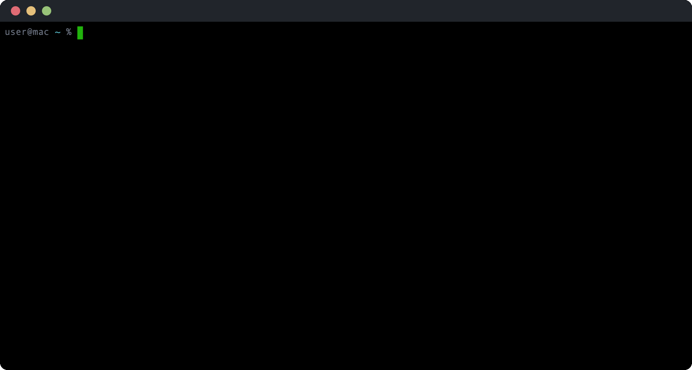
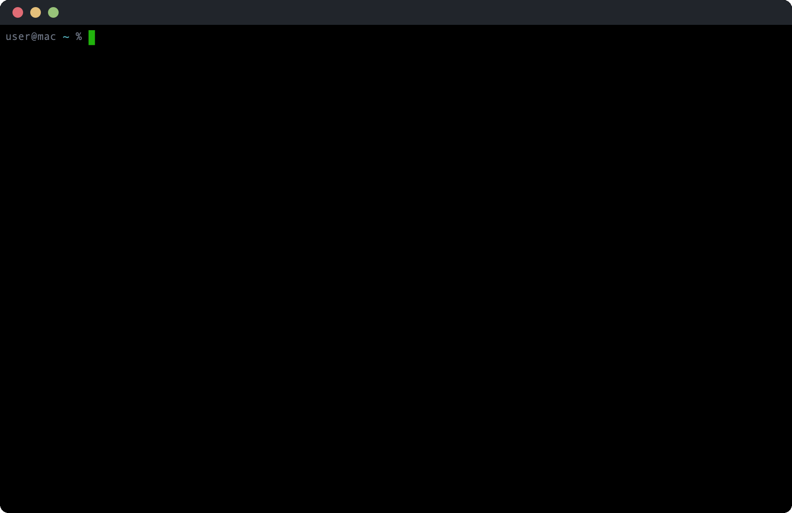

# saddle


Repo wrangler — track, organize, and sync every git repository locally (and remotely).



## Install

```sh
brew install ansilithic/tap/saddle
```

Or from source:

```sh
git clone https://github.com/ansilithic/saddle.git
cd saddle
make build && make install
```

Requires Swift 6.0. macOS 14+ or Linux.

## Authenticate

Saddle uses GitHub's OAuth device flow — no tokens to copy-paste.

```sh
saddle auth
```

A browser opens, a code is displayed. Enter the code, authorize, done.

## Quick start

Add repos to the manifest:

```sh
saddle equip user/dotfiles
saddle equip user/scripts
saddle equip user/cool-cli
```

Or create the manifest directly:

```toml
# $XDG_CONFIG_HOME/saddle/manifest.toml
mount = "~/Developer"

[repos]
"github.com/user/dotfiles"
"github.com/user/scripts"
"github.com/user/cool-cli"
```

Then sync everything with `saddle up`



## Commands


### Health

Check file-presence health across all repos — README, .gitignore, Makefile, and LICENSE. Repos with a `health()` hook function get a pass/fail check too.

```sh
saddle health                # all repos
saddle health --equipped     # only manifest repos
saddle health --unhealthy    # only repos missing files
saddle health --owner <name> # filter by org/owner
```

### Hooks

Optional per-repo scripts that run during sync. Each hook is a single `hook.sh` file with functions for different lifecycle phases. The script's working directory is the repo itself.

```
$XDG_CONFIG_HOME/saddle/hooks/user-dotfiles/hook.sh
```

```bash
#!/usr/bin/env bash

install() {
    make build && make install
}

uninstall() {
    make uninstall
}

health() {
    make health
}
```

- `install` — runs on first clone and subsequent syncs (falls back from `update` if no `update` function is defined)
- `uninstall` — runs on `saddle unequip`
- `health` — checks if the tool is properly installed

Hook names are derived from the repo URL: `github.com/user/dotfiles` becomes `user-dotfiles`. Scripts must be executable.

**Security note**: Hook scripts run with full user privileges. Only install hooks from trusted sources — a malicious hook script has the same access as the current user. Review hook scripts before marking them executable.

## Paths

Saddle follows the [XDG Base Directory Specification](https://specifications.freedesktop.org/basedir-spec/latest/):

| Purpose | Location |
|---------|----------|
| Config (manifest, hooks) | `$XDG_CONFIG_HOME/saddle/` |
| Data (state, credentials) | `$XDG_DATA_HOME/saddle/` |
| Cache (API cache) | `$XDG_CACHE_HOME/saddle/` |

On macOS with default XDG variables, these resolve to `~/Library/Application Support/saddle/` and `~/Library/Caches/saddle/`.

## AI agent usage

Saddle is the local layer — what's cloned, what's dirty, what's out of sync. See [SKILL.md](SKILL.md) for agent-specific instructions.

## License

MIT
