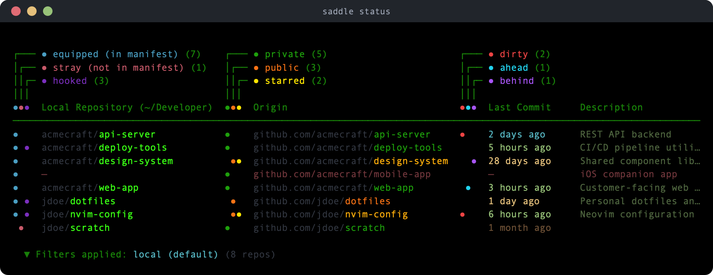
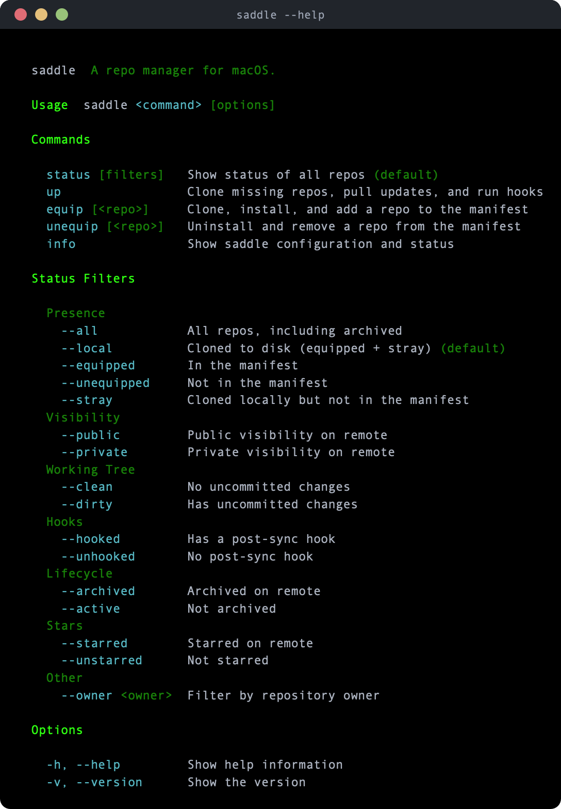

# saddle



A repo manager for macOS — track, sync, and set up every git repository across your machines with a single manifest.

```sh
saddle up
```

One command clones missing repos, pulls updates, and runs install hooks.

## Install

### Homebrew

```sh
brew install ansilithic/tap/saddle
```

### From source

```sh
git clone https://github.com/ansilithic/saddle.git
cd saddle
make build && make install
```

Requires macOS 14+ (Sonoma), Swift 6.0, and the [`gh` CLI](https://cli.github.com/) for GitHub integration.

## Quick start guide

Add repos to your manifest:

```sh
saddle equip https://github.com/you/dotfiles
saddle equip https://github.com/you/scripts
saddle equip https://github.com/you/cool-cli
```

Or create the manifest directly:

```toml
# ~/.config/saddle/manifest.toml
mount = "~/Developer"

[repos]
"github.com/you/dotfiles"
"github.com/you/scripts"
"github.com/you/cool-cli"
```

Sync everything:

```sh
saddle up
```

## Commands



Status filters compose — find exactly what you need:

```sh
saddle --dirty                     # uncommitted changes anywhere
saddle --stray                     # cloned but not in the manifest
saddle --owner acmecraft --public  # filters combine
```

### Hooks

Optional per-repo scripts that run during sync. The script's working directory is the repo itself, wherever it may be.

**Directory format** (recommended):

```
~/.config/saddle/hooks/you-dotfiles/
  install.sh     # first clone
  update.sh      # subsequent syncs (falls back to install.sh)
  uninstall.sh   # saddle unequip
```

**Single-file format:**

```
~/.config/saddle/hooks/you-dotfiles.sh
```

Hook names are derived from the repo URL: `github.com/you/dotfiles` becomes `you-dotfiles`. All scripts must be executable. Output is logged to `~/.local/state/saddle/hooks/`.

## GitHub and GitLab Integration

Saddle delegates authentication to the [`gh`](https://cli.github.com/) and [`glab`](https://gitlab.com/gitlab-org/cli) CLIs. If the user is authenticated to these tools, saddle will show repo visibility, list all remote repos, and display any starred repos too.

## AI agent usage

Where [`gh`](https://cli.github.com/) and [`glab`](https://gitlab.com/gitlab-org/cli) are windows into the remote, saddle is the local layer — what's cloned, what's dirty, what's out of sync. Together they give AI agents full repo visibility across both sides. See [`SKILL.md`](SKILL.md) for agent-specific instructions.

## License

MIT
