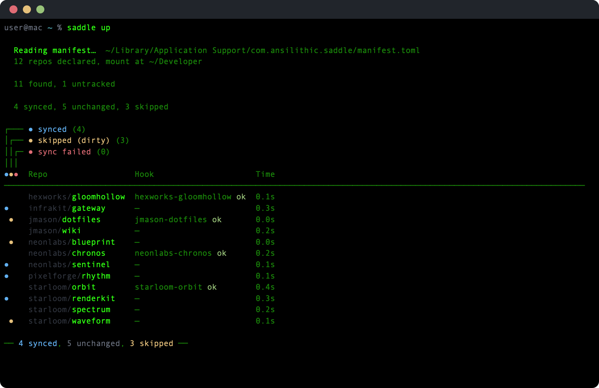

# saddle

Repo wrangler for macOS — track, organize, and sync every git repository locally.


## Install

```sh
brew install ansilithic/tap/saddle
```

Or from source:

```sh
git clone https://github.com/ansilithic/saddle.git
cd saddle
make build && make install
```

Requires macOS 14+ (Sonoma), Swift 6.0, and the [gh CLI](https://cli.github.com/) for GitHub integration.

## Quick start

Add repos to the manifest:

```sh
saddle equip https://github.com/user/dotfiles
saddle equip https://github.com/user/scripts
saddle equip https://github.com/user/cool-cli
```

Or create the manifest directly:

```toml
# ~/Library/Application Support/saddle/manifest.toml
mount = "~/Developer"

[repos]
"github.com/user/dotfiles"
"github.com/user/scripts"
"github.com/user/cool-cli"
```

Then sync everything with `saddle up`



## Commands


### Hooks

Optional per-repo scripts that run during sync. Each hook is a single `hook.sh` file with functions for different lifecycle phases. The script's working directory is the repo itself.

```
~/Library/Application Support/saddle/hooks/user-dotfiles/hook.sh
```

```bash
#!/usr/bin/env bash

install() {
    make build && make install
}

uninstall() {
    make uninstall
}

health() {
    make health
}
```

- `install` — runs on first clone and subsequent syncs (falls back from `update` if no `update` function is defined)
- `uninstall` — runs on `saddle unequip`
- `health` — checks if the tool is properly installed

Hook names are derived from the repo URL: `github.com/user/dotfiles` becomes `user-dotfiles`. Scripts must be executable. Output is logged to `~/Library/Application Support/saddle/hooks/`.

## GitHub and GitLab Integration

Saddle delegates authentication to the [gh](https://cli.github.com/) and [glab](https://gitlab.com/gitlab-org/cli) CLIs. If the user is authenticated to these tools, saddle will show repo visibility, list all remote repos, and display any starred repos too.

## AI agent usage

Where [gh](https://cli.github.com/) and [glab](https://gitlab.com/gitlab-org/cli) are windows into the remote, saddle is the local layer — what's cloned, what's dirty, what's out of sync. Together they give AI agents full repo visibility across both sides. See [SKILL.md](SKILL.md) for agent-specific instructions.

## License

MIT
